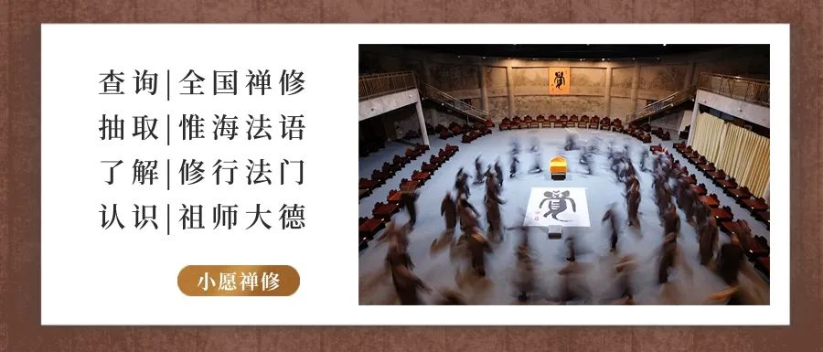

# 如何通过读书提升我们的生命境界？

—— 提升生命境界的阅读之道 ——

我希望以这样的结构来读书：先是自然哲学转向精神和生命哲学，再转向人生哲学和宗教哲学。

我们读书是生命的历程，书要进入性灵，成为生命的一个部分，这就要求：1. 需要选择，选择营养最好的书；2. 要消化吸收，消化吸收了才能成为生命的一个部分

与其读得多，不如读得精；与其读得广，不如读得深；与其浅显容易懂，不如有高度；与其能实用，不如能进入性命。也就是说，要读得真正进入到我们的生命里。

---

READING METHODS

我们应该怎么读书呢？

好书要反复地读，内化到自己的身-心-性命中去。

具体一点讲这样读书的读法，不仅仅是语言和知识性的阅读，还需要体认和返观的方式来读，不仅仅名言概念知识和认知理性，还要有经验实证和知识论-认识论批判的意识。

单纯粗放的客观认知式阅读和原始的粗放经验感觉，都是靠不住的，所以需要反省意识和现观现量及观照智，这样才能达到实义和进入性命。

MENTAL HEALTH

关于心理问题的疑惑

我发现，不少心理咨询师、心理学人的问题，很大程度上，至少过半不仅有心理问题，而且是不易解决的。这些心理问题很大程度上是情绪障碍、七情烦恼，本来应当容易解决，或者说一些情感情绪本来不足以威胁自我和人格，为什么对一些受过高等教育的人却成了大问题呢？

如果一个人只是七情烦恼，久久不能解决，而成为他人生重要的干扰，甚至变成自我结构、人格异常，甚至导致人生的毁伤之类不正常，那就要问问为什么这样呢？

一个文明的人、一个有教养的人、有知识有能力的人，他应该通过学习和思考，通过知识和智慧来建构自我，来塑造人格，来处理自己的问题，有点儿小问题能调解过来，顺利地走过生命历程里的坎坷风雨，为什么却久久不释呢？那其中原因在哪里？

• 可能是内分泌紊乱或神经生理障碍

• 或者是植物神经功能或情绪失调

• 或者是知识和理解欠缺

• 或者是心理知识和自我意识不够

• 抑或是文化素养、身心修养、精神方面的欠缺

READING VALUE

读书的价值

读书可否解决我们的七情烦恼？

其实很多的思想家、宗教家，他们一生不可能说完全健康，或者说终身绝对健康，不出任何的烦恼、问题，但是他们总能走过来。不仅走过来，而且由于痛苦和挫折，或者烦恼，或者苦难，让生命走得更高，为什么？我们不禁思考：我们能不能学一学他们呢？

学习他们意味着我们和圣贤一起，能与古代圣贤大德在一起，我们自己不就成道了吗？那些七情烦恼，不就不成烦恼了嘛。所以我们读书，实际上是一种成长。

我们读书不是说吊书袋子炫耀"我看了很多书"，而是把书里的思想、内容、方法等，内化到我们的心里去。从中增加我们内在的历程、内在的高度。从内在成长，使我们生命的境界得到提升，性命得到修炼，这才是真正的读书的价值。

SPIRITUAL GROWTH

读书成就精神慧命

书，特别是经典性的书籍，往往是精神文明的集中体现，精神文明内化到我们生命中，才能体现我们人之所以为人的独特性。作为人的精神慧命，可以是人性或佛性。我们把人性最高的一种看作是佛性。

所以读圣贤的书，是我们佛性发现和确认的一种重要的途径，读书品道是我们佛性成长的一部分。不是学佛拜佛才是佛性成长。

现代人学佛、拜佛的形式可以有很多。就好像是学佛法拜佛，学习佛法佛经与学习思想文化大师经典著作都是学佛，景仰佛陀菩萨和尊敬效法哲学思想大师都是拜佛祖师，也是佛性成长的重要途径。

—— 阅读，让生命更有深度 ——

本文节选自惟海禅师2016.02.12讲述  
文章图片均来自修道班

关注公众号，获取更多深度阅读内容

第七届禅宗修道班

正在招生中

添加法愿 咨询禅修

[第六届禅宗修道班相关文章](https://mp.weixin.qq.com/mp/appmsgalbum?__biz=MzkyOTcwNjExNQ==&action=getalbum&album_id=4136240336001482760#wechat_redirect)

---

**编辑、审核：法愿**